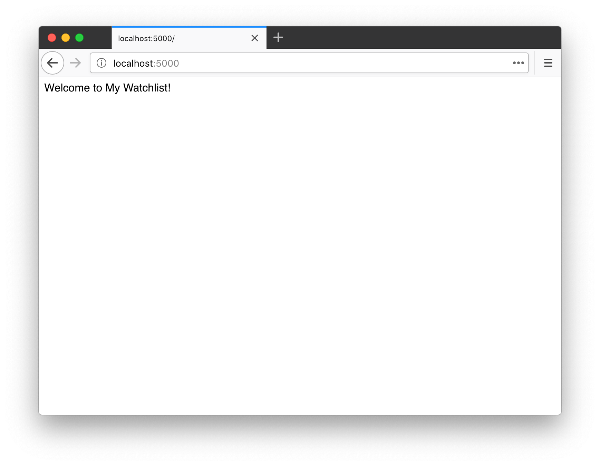

# Hello, Flask!

追溯到最初，Flask 诞生于2010年的愚人节，作为 Armin Ronacher 的一个玩笑。后来，它逐渐发展成为一个成熟的 Python Web 框架，越来越受到开发者的喜爱。目前它在 GitHub 上是 Star 数量最多的 Python Web 框架，没有之一。

Flask 是典型的微框架，作为 Web 框架来说，它仅保留了核心功能：**请求响应处理**由 Werkzeug（WSGI 工具库）完成；**模板渲染**由 Jinja（模板渲染库）完成。

## 主页

先来为我们的程序编写一个简单的主页。主页的 URL 一般就是根地址，即“/”。当用户访问根地址的时候，我们返回一行欢迎文字：

```python
from flask import Flask
app = Flask(__name__)

@app.route('/')
def index():
    return 'Welcome to My Watchlist!'
```

按照惯例，我们把程序保存为 app.py，确保当前目录是项目的根目录，然后在命令行窗口执行下面的命令即可启动程序：

```bash
$ flask run
* Serving Flask app "app.py"
* Environment: production
  WARNING: Do not use the development server in a production environment.
  Use a production WSGI server instead.
* Debug mode: off
* Running on http://127.0.0.1:5000/ (Press CTRL+C to quit)
```

现在打开浏览器，访问本地机的 5000 端口即可访问程序，如下图所示：



*图片待更新*

使用 flask run 命令时，Flask会使用内置的开发服务器来运行程序，这个服务器默认监听本地机的 5000 端口，也就是说，我们通过 URL http://127.0.0.1:5000 或是 http://localhost:5000 就可以访问到这个程序。

**注意** 内置的开发服务器很简陋，只能用于开发时使用，部署上线的时候要换用性能更好的服务器，我们会在最后一章学习。


## 解剖时间

下面我们来分解这个 Flask 程序，了解它的基本构成。

首先我们从 flask 包导入 Flask 类，通过实例化这个类，创建一个程序对象：

```python
from flask import Flask
app = Flask(__name__)
```

接下来，我们要注册一个处理函数，这个函数是处理某个请求的处理函数，Flask 官方把它叫做视图函数（view funciton）。其实你可以不用在乎它叫什么名字，你只需要知道，在用户发出请求后，这类函数会被调用来返回资源的，即“**请求处理函数**”。

我们使用 app.route() 装饰器来为这个函数绑定对应的 URL，也就是说，为它指定一个触发的 URL。这个行为叫做注册路由：

```python
@app.route('/')
def hello():
    return 'Welcome to My Watchlist!'
```

填入 app.route() 装饰器的第一个参数是 URL 规则，这里的“/”指的是根地址。我们只需要写出相对地址，主机地址、端口号等都不需要写出。所以说，这里的“/”对应的是主机名后面的路径部分，完整 URL 就是 http://localhost:5000/。如果我们把程序部署在 http://helloflask.com 域名上，那么对应的完整URL就是 http://helloflask.com/ ；如果我们这里定义的 URL 规则是“/hello”，那么最终的完整 URL 就是  http://helloflask.com/hello 。

整个请求的处理过程如下所示：

1. 当用户在浏览器地址栏访问这个地址，在这里即 http://localhost:5000/
2. 服务器解析请求，发现请求 URL 匹配的 URL 规则是“/”，因此调用对应的处理函数 hello
3. 获取 hello 函数返回值，处理后返回给客户端
4. 浏览器接受响应，显示在窗口

*提示 在 Web 程序的语境下，虽然客户端可能有多种类型，但在本书里通常是指浏览器。*

## 程序发现机制

如果你把上面的程序保存成其他的名字，比如hello.py，这时你会发现执行flask run命令会返回一个错误提示。这是因为Flask默认会假设你把程序存储在名为app.py或wsgi.py的文件中。如果你使用了其他名称，就要设置系统环境变量FLASK_APP来告诉Flask。

Flask通过读取这个文件来找到要运行的程序，你可以把它设置成下面这些值：

* 模块名
* Python导入路径
* 文件目录路径

## 调试模式

在开发时，我们需要开启调试模式（debug mode）。调试模式可以通过将系统环境变量FLASK_ENV设为development来开启。调试模式开启后，当程序出错时，浏览器页面上会显示错误信息；代码出现变动后，程序会自动重载。

## 管理环境变量

现在在启动Flask程序的时候，我们要和两个环境变量打交道：FLASK_APP和FLASK_ENV。当然，因为我们的程序现在的名字是app.py，暂时不需要设置FLASK_APP。为了方便，我们可以安装用来管理系统环境变量的python-dotenv：

```bash
$ pipenv install python-dotenv
```

当python-dotenv安装后，Flask会从项目根目录的.flaskenv和.env文件读取环境变量，我们分别使用文本编辑器创建这两个文件。.flaskenv存储Flask命令行系统相关的公开环境变量；而.env存储敏感数据，所以不应该提交进Git仓库，我们把.env添加到.gitignore文件的结尾（新建一行）来让Git忽略它：

```
.env
```

在新创建的.flaskenv文件里，我们定义FLASK_ENV的值：

```bash
FLASK_ENV=development
```

## 本章小结

这一章我们编写了一个最小的程序，接下来我们会让它逐渐长大。

结束前，让我们提交代码：

```bash
$ git add .
$ git commit -m "Add minimal index page"
$ git push
```

## 进阶提示

* 了解 HTTP 基本知识将会有助于你了解 Flask 的工作原理。
* 阅读文章[《互联网是如何工作的》](https://tutorial.djangogirls.org/zh/how_the_internet_works/)。
* 如果你是《Flask Web 开发实战》的读者，这部分的进阶内容可以在第 1 章《初识 Flask》和第 2 章《HTTP 和 Flask》找到。